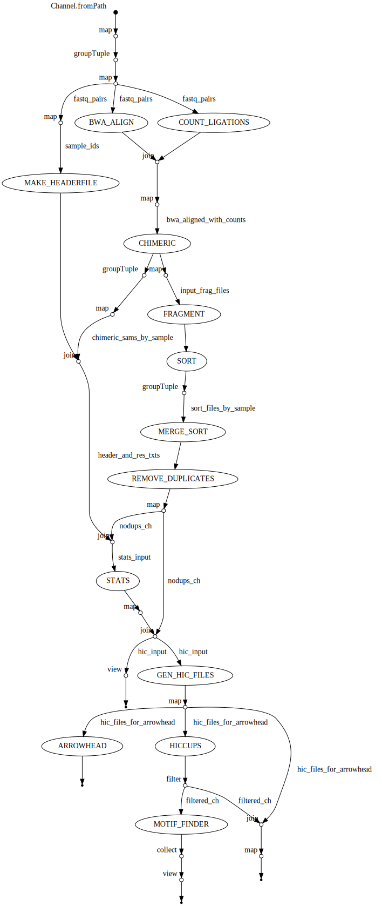

# Juicer 1.6 Nextflow

This repository contains a Nextflow implementation of the Juicer 1.6 pipeline for Hi-C data analysis. The pipeline is designed to process Hi-C sequencing data, align reads, detect chimeric fragments, and generate contact maps and other downstream analyses such as loop calling and domain identification.

## Author

This pipeline was developed by **Paolo Inglese** as part of the Fondazione Istituto Italiano di Tecnologia.
Created on **May 7th, 2025**.

## Features

- **Nextflow DSL2**: Modular and scalable pipeline implementation.
- **PBS Pro Integration**: Configured for HPC environments using PBS Pro.
- **GPU Support**: Leverages GPUs for computationally intensive steps like HiCCUPS.
- **Customizable Parameters**: Easily configurable for different genomes, restriction sites, and resolutions.
- **Comprehensive Outputs**: Generates `.hic` files, contact domains, loops, and motif analysis results.

## Requirements

- **Nextflow**: Ensure Nextflow is installed and available in your `PATH`.
- **PBS Pro**: The pipeline is configured to run on PBS Pro-based HPC systems.
- **Java**: Required for running Nextflow and Juicer tools.
- **BWA**: For read alignment.
- **Juicer Tools**: Included in the pipeline for downstream Hi-C analysis.
- **CUDA**: Required for GPU-based steps like HiCCUPS.

## Installation

1. Clone the repository:

   ```bash
   git clone https://gitlab.iit.it/gnm001/juicer-1.6-nextflow.git
   cd juicer-1.6-nextflow
   ```

2. Ensure all dependencies are installed and accessible.

3. Modify the `template.config` file to match your HPC environment and data paths.

### IMPORTANT:

Before launching the workflow, create a symbolic link to the juicer_tools jar

```bash
cd scripts/common
ln -s juicer_tools.1.9.9_jcuda.0.8.jar juicer_tools.jar
```

## Note on MegaMap

In order to combine the results of replicates, run the customised script `mega.mod.sh` in
the `scripts/common` folder.
This script has been tested on the IIT HPC cluster.

## Usage

1. Prepare your input data:

   - Organize your FASTQ files in the following structure:

     ```
     <input_dir>/fastq/
     ├── sample_R1_001.fastq.gz
     └── sample_R2_001.fastq.gz
     ```

     with `<input_dir> = <run_id>/<sample_id>`.

     By default, `<output_dir>` is identical to `<input_dir>`.

2. Submit the pipeline using the provided script:

   ```bash
   qsub -v RUN_ID=<run_id> SAMPLE_ID=<sample_id> submit_juicer_nxf.sh
   ```

   Replace `<run_id>` with a unique identifier for your run, and `<sample_id>` with a unique identifier for your sample.

3. Monitor the logs in the directory `<output_dir>/logs`:

   - Standard output: `JUICER-NXF.out`
   - Error logs: `JUICER-NXF.err`

4. Outputs will be saved in the directory specified by `params.output_dir` in the configuration file.

## Configuration

The pipeline is configured using `template.config`. Key parameters include:

- **`params.input_dir`**: Directory containing input FASTQ files.
- **`params.output_dir`**: Directory for storing pipeline outputs.
- **`params.genomeID`**: Genome identifier (e.g., `mm10`).
- **`params.refSeq`**: Path to the genome assembly file.
- **`params.site`**: Restriction enzyme site (e.g., `Arima`).
- **`params.resolutions`**: Resolutions for Hi-C map generation.

To customize the configuration for a specific run, the `submit_juicer_nxf.sh` script dynamically replaces `<run_id>` placeholders in `template.config`.

## Pipeline Overview

The pipeline consists of the following steps:

1. **FASTQ Pairing**: Identifies and groups paired-end FASTQ files.
2. **Header File Creation**: Generates metadata for each sample.
3. **Read Alignment**: Aligns reads using BWA.
4. **Ligation Counting**: Counts ligation events based on restriction sites.
5. **Chimeric Fragment Detection**: Identifies and processes chimeric reads.
6. **Fragment Sorting and Merging**: Sorts and merges fragments for downstream analysis.
7. **Duplicate Removal**: Removes duplicate reads.
8. **Statistics Generation**: Computes Hi-C statistics.
9. **Contact Map Generation**: Produces `.hic` files at multiple resolutions.
10. **Arrowhead and HiCCUPS**: Identifies contact domains and loops.
11. **Motif Finder**: Analyzes motifs in detected loops.

## Outputs

- **Aligned Reads**: SAM files for each sample.
- **Contact Maps**: `.hic` files at various resolutions.
- **Contact Domains**: Arrowhead output.
- **Loops**: HiCCUPS output.
- **Motif Analysis**: Results from motif finder.

## Workflow Diagram

The following diagram illustrates the overall structure of the Juicer 1.6 Nextflow pipeline:



## Support

For issues or questions, please contact the repository maintainer or open an issue in the GitLab repository.

## License

This project is licensed under the MIT License. See the `LICENSE` file for details.

## Acknowledgments

This pipeline is based on the Juicer 1.6 pipeline and adapted for Nextflow by the GNM team at IIT.

## Project Status

The pipeline is actively maintained. Contributions and suggestions are welcome!
